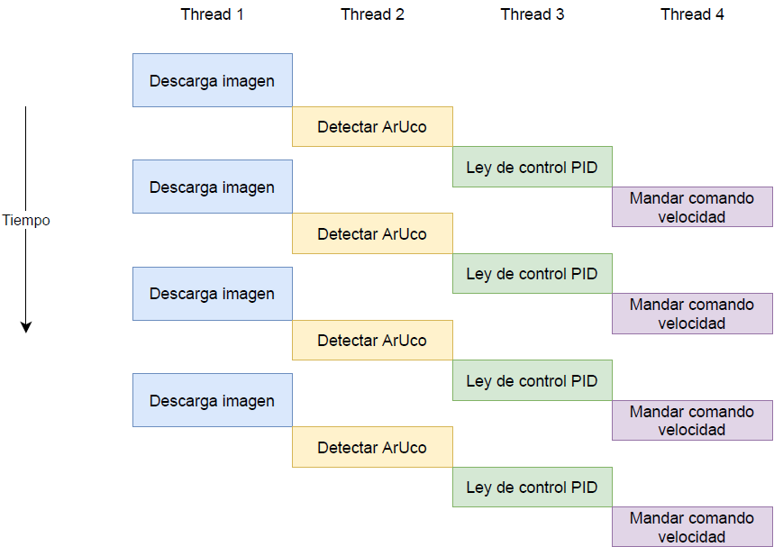

# Proyecto CEABOT

## Objetivo del proyecto
La idea principal es implementar un algoritmo de tipo Leader-Follower entre dos robots móviles. Para ello, 
se ha hecho uso de un simulador de un entorno submarino que consta de tres robots. Dos de ellos 
son portadores de un par de códigos ArUco, con los que un tercer robot podrá realizar el seguimiento al hacer 
un procesamiento previo de las imágenes que captura su cámara.

## Organización del proyecto
El código del proyecto se compone de los siguientes archivos y carpetas.

- main.py: es el script principal, desde el que se inicializa la interfaz de usuario, los controladores
para el movimiento independiente de cada robot, las cámaras y el pipeline de funcionamiento.

- utils.py: archivo de utilidades. Contiene (1) los distintos modelos de robot, en los que se definen los
puertos HTTP que tienen asociados para acceder al control de sus movimientos y a su cámara, (2) las funciones que
construyen las peticiones HTTP y (3) las funciones para recoger las imágenes de las cámaras, indincando la calidad
deseada para estas.

- ImagePipeline.py: definición de la clase que controlan la sección del pipeline encargada de la adquisición de imágenes, así como de 
detectar los códigos ArUcos a través de distintas características de imagen.

- aruco_utils.py: pequeño script para adquirir las imágenes de los códigos ArUco que se van a colocar
en los robots. Esto permite acelerar el proceso de detección, al reducir en gran medida el rango de posibles
códigos que se pueden encontrar en una imagen.

- interface_class/: carpeta que contiene las clases definidas para la creación de distintas pestañas que componen 
una interfaz de usuario modular. La pestaña _main_ permite cerrar la interfaz. Además, aparecen tres pestañas de cámara
y tres pestañas de control, para cada uno de los robots. La pestaña de cámara del BlueROV incluye además 
un selector para activar o desactivar el seguimiento automático del _Leader_. Se ha utilizado la librería TKinter para el 
diseño de la interfaz modular.

- pipeline/: carpeta que recoge los scripts donde se define el pipeline de funcionamiento. La siguiente imagen
sirve de ayuda para entender sus etapas.

